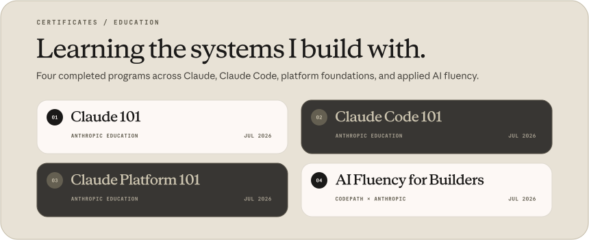

<!--
  Profile README for github.com/atlasatakahraman
  GitHub removes custom CSS and @font-face rules from README files.
  The art-directed typography below is therefore converted to outlined,
  self-contained SVG assets using Anthropic Serif, Sans, and Mono.
-->

  

  &nbsp;
  &nbsp;
  &nbsp;
  &nbsp;
  

 

## Hello — I’m Atlas.

I’m a creative developer and graphic designer based in **Kuşadası, Türkiye**. I move between interface design and implementation: defining the visual language, then building the product in TypeScript, Rust, or Python.

My work centers on **local-first desktop software**, **media tooling**, **AI-assisted image and video workflows**, and focused interfaces that turn complicated commands into clear products. A background in graphic design and video editing keeps the work visual; years around gaming and creator communities keep it practical.

> **Currently:** building [**TheAtlas Media**](https://github.com/atlasatakahraman/TheAtlas-Media) toward its first public release — a private, cross-platform desktop workspace for downloading, extracting, and converting media.

 

  

  &nbsp;
  &nbsp;
  &nbsp;
  

 

  

### The principles behind the pixels

**Clarity over ceremony.** The interface should explain the system without exposing all of its complexity.

**Local by default.** When a workflow can stay private, fast, and on-device, it should.

**Design and engineering belong together.** A polished surface is strongest when the architecture underneath is equally considered.

 

  

  &nbsp;
  &nbsp;
  &nbsp;
  

 

### What I’m exploring now

- Native-feeling desktop experiences with **Tauri 2** and **Rust**
- Modern product systems with **Next.js**, **React**, **TypeScript**, and **shadcn/ui**
- Media pipelines built around **FFmpeg**, metadata, parallel downloads, and conversion presets
- Creator and gaming tools connected to live platforms and public APIs
- A highly personal **Arch Linux + Hyprland** environment for code and creative work

 

  &nbsp;
  &nbsp;
  &nbsp;
  &nbsp;
  &nbsp;
  &nbsp;
  

  Designing the interface. Engineering the system. Refining the details.

