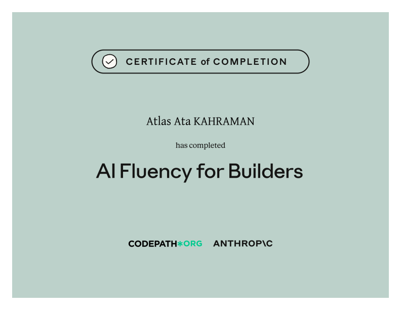

  

  

# AI Fluency for Builders

**AI Fluency for Builders** is a CodePath × Anthropic course about collaborating with AI across the full product journey—from framing a customer problem to deciding whether a result is ready to ship. Its focus is not a particular tool; it is the judgment needed to use AI intentionally and responsibly.

## The 4D Framework

The course organizes practical AI collaboration around four connected skills:

1. **Delegation** — deciding what work to give AI and what judgment must remain human
2. **Description** — supplying the context, constraints, values, and acceptance criteria needed for useful results
3. **Discernment** — evaluating AI output rather than accepting “it works” as the standard
4. **Diligence** — owning the quality, impact, testing, and consequences of what is shipped

## What the course covers

- A practical mental model of generative AI’s capabilities and limitations
- Reusable briefs that communicate values, context, and constraints
- Inner-loop and outer-loop AI collaboration
- Translating user needs into precise instructions
- Defining acceptance tests before implementation
- Evaluating AI-generated code through multiple quality lenses
- Critiquing AI-generated user experiences with actionable feedback
- Building feedback loops and tests around AI-assisted work
- Choosing whether to ship, revise, or stop an AI-assisted solution

## What this certificate means

This certificate confirms completion of the builder-focused AI Fluency curriculum and its final quiz. It represents familiarity with a structured framework for delegating responsibly, describing work clearly, evaluating output critically, and retaining ownership of the final result.

It is a **course-completion credential**, not a claim that AI can replace product judgment, engineering review, or accountability.

## How it connects to my work

The framework reflects how I want to build TheAtlas: use AI to increase range and speed, while keeping product direction, interface taste, technical review, privacy decisions, and responsibility firmly human-owned.

## Credential

- **Recipient:** Atlas Ata Kahraman
- **Issuers:** CodePath × Anthropic
- **Completed:** July 2026
- **Format:** 10 lectures, approximately 1 hour of video, and 1 quiz
- **Credential:** [View the original certificate PDF](./certificate.pdf)
- **Course:** [View the official AI Fluency for Builders course](https://anthropic.skilljar.com/ai-fluency-for-builders)

---

[← Back to all certificates](../README.md)
