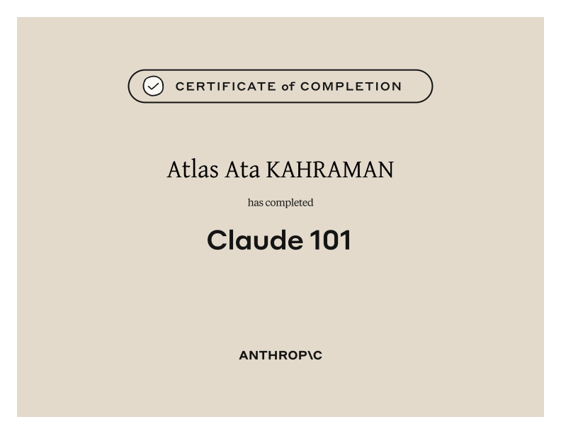

  

  

# Claude 101

**Claude 101** is Anthropic Academy’s foundation course for using Claude effectively in everyday work. It moves beyond simply opening a chat by introducing the features and workflow patterns that make Claude useful across research, writing, organization, creation, and role-specific tasks.

## What the course covers

- What Claude is and how to begin a productive conversation
- Writing clearer instructions and improving results through iteration
- Claude across Chat, Cowork, and Code
- Organizing long-running work with Projects
- Creating interactive outputs with Artifacts
- Reusing workflows through Skills
- Connecting tools and searching organizational knowledge
- Using Research mode for deeper investigations
- Choosing the right Claude workflow for different professional roles

## What this certificate means

This certificate confirms completion of Anthropic’s introductory Claude curriculum. It represents a practical foundation in selecting Claude features, structuring requests, organizing context, and using AI as a deliberate collaborator rather than treating it as a one-shot answer engine.

It is a **course-completion credential**, not a claim of professional accreditation or expert-level mastery.

## How it connects to my work

The course supports how I use AI while designing and developing TheAtlas: organizing product research, exploring interface directions, documenting decisions, and turning broad ideas into structured implementation tasks.

## Credential

- **Recipient:** Atlas Ata Kahraman
- **Issuer:** Anthropic Education / Anthropic Academy
- **Completed:** July 2026
- **Credential:** [View the original certificate PDF](./certificate.pdf)
- **Course:** [View the official Claude 101 course](https://anthropic.skilljar.com/claude-101)

---

[← Back to all certificates](../README.md)
