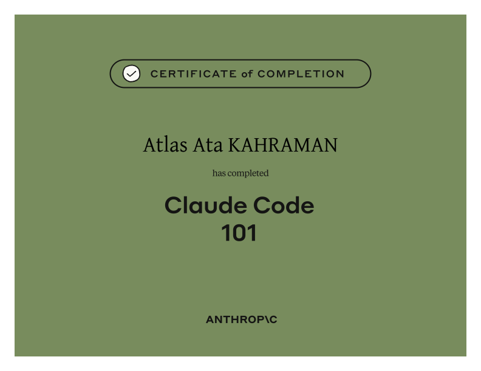

  

  

# Claude Code 101

**Claude Code 101** introduces Claude Code as an agentic development environment rather than a chat-based coding assistant. The course focuses on understanding how the agent gathers context, takes action, verifies results, and remains under developer oversight.

## What the course covers

- How AI coding agents differ from chat-based assistants
- The agentic loop, context windows, tools, and permissions
- Claude Code in the terminal, VS Code, JetBrains, Claude Desktop, and the web
- Approval modes, auto-accept, and Plan Mode
- The repeatable **Explore → Plan → Code → Commit** workflow
- Context management with `/compact`, `/clear`, and `/context`
- AI-assisted code review
- Project memory and conventions through `CLAUDE.md`
- Reusable Skills and specialized subagents
- Connecting external systems through MCP servers
- Deterministic safeguards and automation through hooks

## What this certificate means

This certificate confirms completion of Anthropic’s introductory Claude Code curriculum, including its final quiz. It represents familiarity with the mental models and practical workflows required to supervise an AI coding agent, manage context, review its changes, and customize it for a real codebase.

It is a **course-completion credential**, not a substitute for software-engineering experience or an expert certification.

## How it connects to my work

Claude Code fits my end-to-end product workflow: exploring an unfamiliar part of a repository, planning a change, implementing it, reviewing the diff, and preserving project conventions. These practices are especially relevant to the TypeScript, Rust, and Tauri codebases behind TheAtlas projects.

## Credential

- **Recipient:** Atlas Ata Kahraman
- **Issuer:** Anthropic Education / Anthropic Academy
- **Completed:** July 2026
- **Credential:** [View the original certificate PDF](./certificate.pdf)
- **Course:** [View the official Claude Code 101 course](https://anthropic.skilljar.com/claude-code-101)

---

[← Back to all certificates](../README.md)
