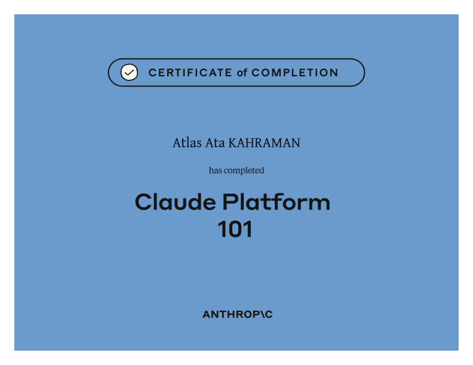

  

  

# Claude Platform 101

**Claude Platform 101** is a developer-focused introduction to building applications and agents on the Claude Developer Platform. It bridges the gap between using Claude in a browser and integrating Claude into software that can call tools, act on systems, and manage longer-running work.

## What the course covers

- The structure of a Claude API request and response
- Sending a first API request with the TypeScript SDK
- Selecting Opus, Sonnet, or Haiku for cost, speed, and capability needs
- Understanding and implementing an agent loop
- Tool use and extended thinking
- Anthropic-hosted tools such as web search, web fetch, and code execution
- Packaging repeatable procedures with Skills
- Connecting third-party systems through MCP servers
- Context-window and cost-management patterns
- Workspaces, limits, and the Console Workbench
- Choosing between self-managed loops and managed agents
- Building and consuming a managed-agent event stream

## What this certificate means

This certificate confirms completion of Anthropic’s foundational developer-platform curriculum. It represents an understanding of the components behind Claude-powered applications: structured API requests, model selection, tool use, agent loops, context management, MCP integration, and operational cost awareness.

It is a **course-completion credential**, not a production-readiness guarantee or professional architect certification.

## How it connects to my work

The course is directly relevant to adding carefully scoped AI capabilities to TheAtlas products. It provides a stronger foundation for choosing models, controlling permissions, connecting tools, and keeping local-first desktop experiences predictable when they communicate with cloud AI services.

## Credential

- **Recipient:** Atlas Ata Kahraman
- **Issuer:** Anthropic Education / Anthropic Academy
- **Completed:** July 2026
- **Credential:** [View the original certificate PDF](./certificate.pdf)
- **Course:** [View the official Claude Platform 101 course](https://anthropic.skilljar.com/claude-platform-101)

---

[← Back to all certificates](../README.md)
